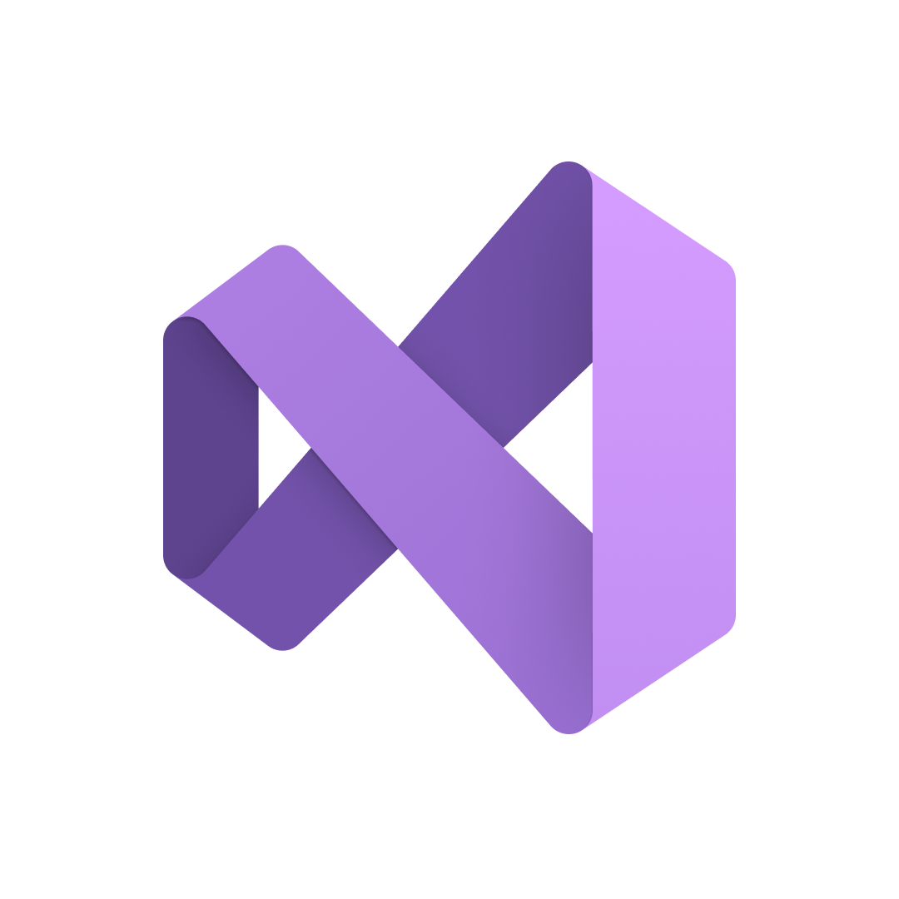

<h1 align="center"><b>Team Netsky</b> <br>
  
  </h1> 
<a name="desc"></a>
  <h1>💾 Description </h1>
  <p>Welcome to the <b>Netsky team </b>, we are a dedicated team of students who have created a game centered around accurate writing and precise mathematical computations. Our mission is to make learning fun and interactive.Dive in, sharpen your mind, and enjoy the games we've designed to challenge and inspire.
  </p>
  <h1>🧑‍🤝 Our Team </h1>
  <p>

-[Petar Dimitrov](https://github.com/PADimitrov23) - Scrum trainer <br>

-[Kaloyan Pozharliev](https://github.com/KBPozharliev23) - Backend Developer <br>

-[Georgi Pavlov](https://github.com/GZPavlov23) - Frontend Developer <br>

-[Ivayla Keserdzhieva](https://github.com/IRKeserdzhieva23)- Designer <br>

-[Velizar Vulkov](https://github.com/VTVulkov23) - Co-Designer <br>
  </p>

  <h1>💽 Used Technologies</h1>
  <p align="left">
  <p><b>IDE and version control system:</b></p>
    <a>  </a> 
    <a>  </a>
    <a>  </a>
    <p><b>Programming languages and third-party libraries:</b></p>
    <a>  </a>
    <a>  </a>
    <p><b>Tools used for design</b></p>
    <a>  </a>
    <a>  </a>
    <p><b>Tools used for documantation, communication and presentation:</b></p>
    <a>  </a>
    <a>  </a>
    <a>  </a>
  </p>
<h1>📥 Download</h1>
<p>To download our project,you can clone our repository by pasting this command in your command prompt:</p>

```
git clone https://github.com/codingburgas/sprint-math-games-9th-grade-netsky.git
```
   <h1>📋 Documents</h1>
  <p>
 -<a href ="https://codingburgas-my.sharepoint.com/:w:/g/personal/padimitrov23_codingburgas_bg/ER8d3tyKCpZJsGK-rfPvCqMBZogSj0u6jFoh_KyHvXwH5A?e=tV4jRw" >📜 Documentation</h2><br>
 -<a href ="https://codingburgas-my.sharepoint.com/:p:/g/personal/padimitrov23_codingburgas_bg/EZzHOOlYcQBKsLcxv29Hj48BhYeU1_gukOtrkq0I9GNjMw?e=zUW8tl" >📄Presentation</h2>
</p>